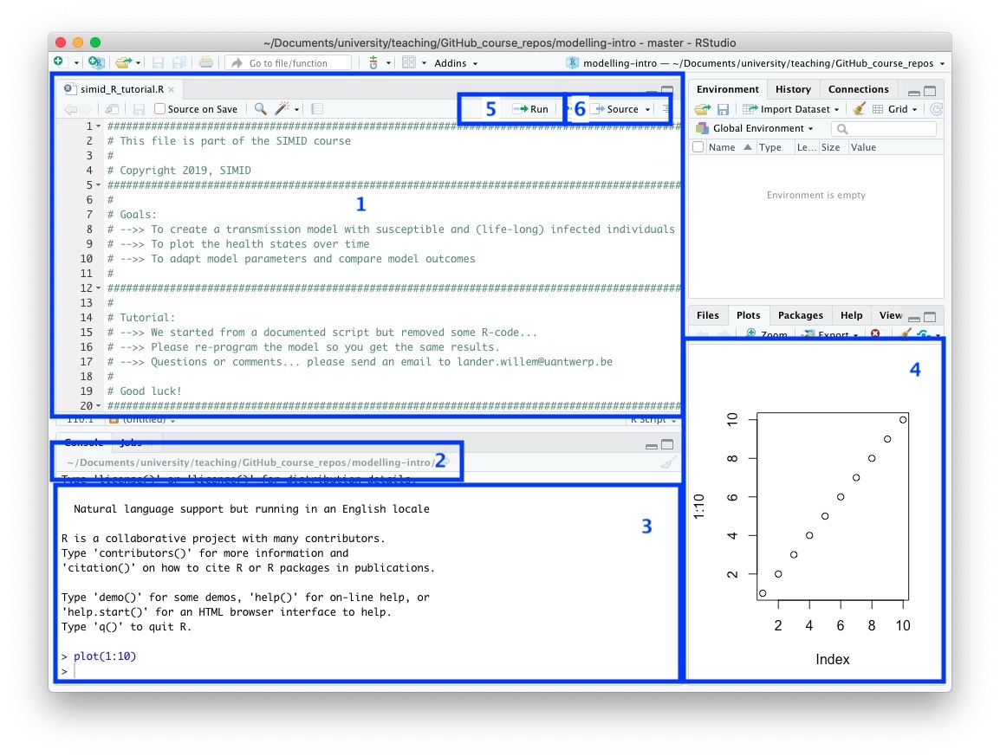

```{r libs, cache=FALSE, echo=FALSE, results = "hide", warning = FALSE}
library('curl')
```

```{r setup, echo=FALSE}
knitr::opts_chunk$set(fig.cap='', fig.align="center", message=FALSE, tidy=TRUE, warning=FALSE)
```

# Objectives
The aim of this tutorial is to introduce you to the basics of [RStudio](http://www.rstudio.com/products/rstudio/download/), which is a very usefull graphic user interface (GUI). The default installation of [RStudio](http://www.rstudio.com/products/rstudio/download/) might contain an old version of [R](http://cran.r-project.org). Please make sure that you also install a recent version of [R](http://cran.r-project.org) (at least version: R-3.5.0).

We recommend to use [RStudio](http://www.rstudio.com/products/rstudio/download/) to manage your R-code (in a file called 'file.R', where you can replace 'file' with any name you like) separate to your executed code in the Console window. It also holds plots, the environment and history window. In this 'file.R' you can store the useful and checked code for future use. For example, you could start a new R file and store in it all the commands below.   


# Example

Whth the following screenshot of RStudio, we would like to focus on different usefull parts.





1. The R-file (`simid_R_tutorial.R` in this case) in which you can add and modify code and save afterwards. You can execute the code (see below).

2. Your working directory. This is the folder on your computer in which you are working. It is likely to be the folder in which the R code is saved (but it doesn't have to be). 
Each computer will have a different specified address for the working directory. Upon opening RStudio, you can find out "where you are" using

3. The console where you can by type (or copy and paste) the R commands to execute (hit `enter`).

4. Window for plots. Use the arrows to get previous plots back.

5. Select R-code in your document and press the "Run" button to execute. Or use the shortcut `cmd + enter`on MacOS or `shift + R` on Windows.

6. "Source" button to execute the active R-script.
 


<div>

# Navigate
Top: [Index](index.html) Next: [Introduction to R](intro_to_r_lw.html)
</div>

